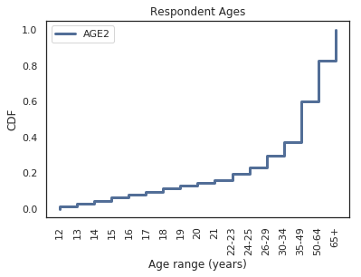
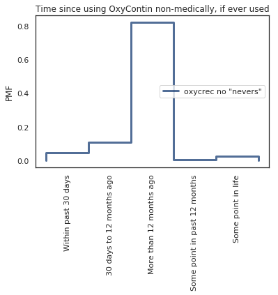
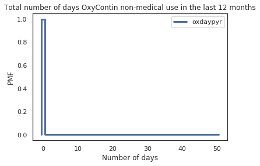
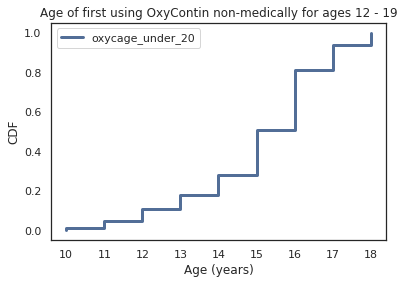
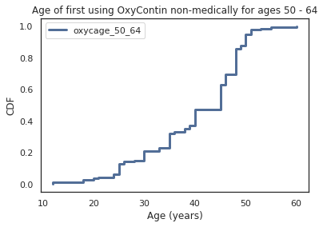
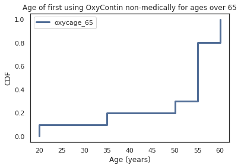

### Exploring OxyContin Use in the United States 

#### Introduction
The primary focus of this investigation was to investigate and interpret information in the NSDUH data set on medical and non-medical OxyContin use.  [According to the CDC](https://www.cdc.gov/drugoverdose/opioids/prescribed.html), OxyContin is among the most common prescription opioids involved in overdose death. OxyContin was approved for use by the FDA in 1995. The FDA at the time believed that because the drug was formulated to be slowly released in the body it would be less easy to abuse. However, since its approval OxyContin became the center of the opioid problem ([source](https://www.fda.gov/downloads/Drugs/DrugSafety/InformationbyDrugClass/UCM566985.pdf)).

#### The Data Set

For this exploration, I chose to look at data from the 2014 National Survey on Drug Use and Health (NSDUH). This survey includes a number of questions asking participants about their history of OxyContin use, among other painkillers. NSDUH surveys after this year scaled back their specific OxyContin-related questions, so I chose to use the most recent survey in this study that provided a fair amount of information.

According to the [Substance Abuse and Mental Health Data Archive's page on the NSDUH data set](https://www.datafiles.samhsa.gov/study-series/national-survey-drug-use-and-health-nsduh-nid13517),

> "The National Survey on Drug Use and Health (NSDUH) series, formerly titled National Household Survey on Drug Abuse, is a major source of statistical information on the use of illicit drugs, alcohol, and tobacco and on mental health issues among U.S. civilians who are non-institutional population aged 12 or older. The survey tracks trends in specific substance use and mental illness measures and assesses the consequences of these conditions by examining mental and/or substance use disorders and treatment for these disorders."

This data set can be used to identify demographics of people at risk for abusing drugs and to find links between mental health and drug use.

The terms of use for using this data can be found on the [SAMDHA terms of use page](https://www.datafiles.samhsa.gov/info/terms-use-nid3422). One of the primary terms of use is that this data cannot be used to identify individuals who participated in the survey. I have not provided any identifying information about participants in this study.

##### Study Details
The codebook for the 2014 NSDUH study can be found [here](http://samhda.s3-us-gov-west-1.amazonaws.com/s3fs-public/field-uploads-protected/studies/NSDUH-2014/NSDUH-2014-datasets/NSDUH-2014-DS0001/NSDUH-2014-DS0001-info/NSDUH-2014-DS0001-info-codebook.pdf).

The target demographic of the survey is the civilian, non-institutionalized population of the United States who were 12 years of age or older at the time of the survey. The sample population includes the household population of all 50 states and the District of Columbia. Along with households, residents of non-institutional group quarters, such as dormitories, and people with no permanent residence. States with larger populations had larger sample sizes than smaller states and the District of Columbia. The sample allocations for the age groups surveyed are as follows: 25% for 12-17 year olds, 25% for 18-25 year olds, 15% for 26-34 year olds, 20% for 35-49 year olds, and 15% for adults over 50 years old.

The study was conducted using computer-assisted-interviewing (CAI) methods. This includes both computer-assisted personal interviews, and computer-assisted self interviews. The core of the study includes questions on the use of tobacco, alcohol, marijuana, cocaine, crack cocaine, heroine, hallucinogens, inhalants, pain relievers, tranquilizers, stimulants, and sedatives. There are also supplemental questions on demographics and mental health.

There are limitations of the 2014 survey listed in the codebook for this survey, which are important to note:
1. The data in the survey is self-reported, which means that it relies on the memory and truthfulness of the respondents' answers.
2. The survey is cross-sectional. Participants were interviewed once and not followed for additional interviews in the future, so the survey does not provide information on how an individual's drug use changes over time.
3. The survey targets the civilian population of the United States, so active-duty military and individuals in institutional group quarters such as prisons and nursing homes are excluded. The codebook estimates that about 3% of the US population is excluded for this year.

##### Survey Variables Used in Study
The 2014 NSDUH survey includes several variables pertaining to OxyContin use. I decided to use the following questions:

1. OXYCAGE: AGE WHEN FIRST USED OXYCONTIN NONMEDICALLY
    -How old were you the first time you used OxyContin that was not prescribed for you or that you took only for the experience or feeling it caused?
2. OXYCREC: TIME SINCE LAST USED OXYCONTIN NONMEDICALLY
    -How long has it been since you last used OxyContin that was not prescribed for you or that you took only for the experience or feeling it caused?
3. OXYYRTOT: TOTAL # DAYS USED OXYCONTIN PAST 12 MONTHS
    -Total number of days used OxyContin in the past 12 months.
4. OXDAYPYR: # DAYS USED OXYCONTIN "NM" PAST 12 MONTHS
    -On how may days in the past 12 months did you use OxyContin that was not prescribed for you or that you took only for the experience or feeling it caused?

It is important here to define the term *non-medically* as "use of the substance that was not prescribed for the respondent, or that the respondent took only for the experience or feeling it caused. I will be using this term frequently throughout this report.

All of these questions came from the pain reliever section of the self-administered substance use questions of the data set. Some logical editing was performed on these questions. The full procedure can be found in the codebook under the Logical Editing section, but in summary, variables were reassigned for consistency across respondent answers. An example is if the respondent answered that they have never used a particular drug, but later listed a version of that drug as something they had used, their answer to the first question was logically assigned to be that they had used it at some point.

Along with the OxyContin-specific questions, I also looked at a variable relating to the age of the participants.
1. AGE2: RECODE - FINAL EDITED AGE

This variable was determined using the respondents' answers reported age, birthday, and the time the study was conducted. It groups respondents into 17 age groups, with the range of ages in each group varying.

Finally, I also used the final person-level weights calculated for each participant for resampling ('ANALWT_C'). This variable indicates the number of people one respondent represents in the study.

###### Preparing the Data for Analysis
To create a more manageable amount of data for analysis, I created a DataFrame that only contained the columns of the 2014 NSDUH survey that I wanted to analyze (the questions listed in the previous section), the sample weights ('ANALWT\_C'), the age group of the respondent ('AGE2'), and the year of the survey, which I added as a column to the data. Because the data was given categorically, I converted it to numeric values as well.

To clean the data, I replaced several categorical codes to answers with NaNs, or with 0s, depending on the question's application. Below is a list of the variables, the codes that were replaced by another value, and the values that were substituted. These codes come from the codebooks for each survey year.:
- OXCNNMAGE:
    - 981: NEVER USED PAIN RLVRS Logically assigned -> NaN
    - 985: BAD DATA Logically assigned -> NaN
    - 991: NEVER USED/MISUSED PAIN RELIEVERS -> NaN
    - 993: DID NOT USE IN THE PAST 12 MONTHS -> NaN
    - 994: DON'T KNOW -> NaN
    - 997: REFUSED -> NaN
    - 998: BLANK (NO ANSWER) -> NaN
- OXYCAGE:
    - 981: NEVER USED OXYCONTIN Logically assigned -> NaN
    - 985: BAD DATA Logically assigned -> NaN
    - 991: NEVER USED OXYCONTIN -> NaN
    - 994: DON'T KNOW -> NaN
    - 997: REFUSED -> NaN
    - 998: BLANK (NO ANSWER) -> NaN
- OXYCREC:
    - 85: BAD DATA Logically assigned -> NaN
    - 97: REFUSED -> NaN
    - 98: BLANK (NO ANSWER) -> NaN
- OXYYRTOT:
    - 981: NEVER USED OXYCONTIN Logically assigned -> 0
    - 985: BAD DATA Logically assigned -> NaN
    - 991: NEVER USED OXYCONTIN -> 0
    - 993: DID NOT USE OXYCONTIN IN THE PAST 12 MOS -> 0
    - 994: DON'T KNOW -> NaN
    - 997: REFUSED -> NaN
    - 998: BLANK (NO ANSWER) -> NaN
- OXDAYPYR:
    - 981: NEVER USED OXYCONTIN Logically assigned -> 0
    - 985: BAD DATA Logically assigned -> NaN
    - 989: LEGITIMATE SKIP Logically assigned -> NaN
    - 991: NEVER USED OXYCONTIN -> 0
    - 993: DID NOT USE OXYCONTIN IN THE PAST 12 MOS -> 0
    - 997: REFUSED -> NaN
    - 998: BLANK (NO ANSWER) -> NaN
    - 999: LEGITIMATE SKIP -> NaN
    
I chose to replace some codes in the last two variables with 0s because respondents could either give a number of days or answer that they never used OxyContin in the last 12 months or ever. I wanted to make it easier to visualize these answers along with the responses from people who had used OxyContin in the past year, so I converted them to a usable numeric value. This has the added benefit of being very easy to filter out when looking at only the people who used OxyContin in the 12 months prior to the survey.

Finally, I resampled the cleaned data using the person-level sample weights.

#### Analysis of the Data

##### Individual Variables
I started my analysis by looking at the individual variables to get an idea of the responses to the survey and to pull out any information that may generate more analysis questions.

###### Age of Respondents.

The 'AGE2' variable groups respondents into 17 categories:
1. Respondent is 12 years old
2. Respondent is 13 years old
3. Respondent is 14 years old
4. Respondent is 15 years old
5. Respondent is 16 years old
6. Respondent is 17 years old
7. Respondent is 18 years old
8. Respondent is 19 years old
9. Respondent is 20 years old
10. Respondent is 21 years old
11. Respondent is 22 or 23 years old
12. Respondent is 24 or 25 years old
13. Respondent is between 26 and 29 years old
14. Respondent is between 30 and 34 years old
15. Respondent is between 35 and 49 years old
16. Respondent is between 50 and 64 years old
17. Respondent is 65 years old or older

The PMF and CDF of the ages are shown below.

To get a better idea of the age distribution, I compressed the younger age groups. The new age groups I made are:
1. Respondent is between 12 and 19 years old
2. Respondent is between 20 and 29 years old
3. Respondent is between 30 and 34 years old
4. Respondent is between 35 and 49 years old
5. Respondent is between 50 and 64 years old
6. Respondent is 65 years old or older

The PMF and CDF of the new groupings are shown below.

###### Age of First Trying OxyContin Non-medically

###### Time Since Last Trying OxyContin Non-medically

###### Total Number of Days Using OxyContin in 12 Months Prior to Survey

###### Number of Days Using OxyContin Non-Medically in 12 Months Prior to Survey

##### Relationships by Age

