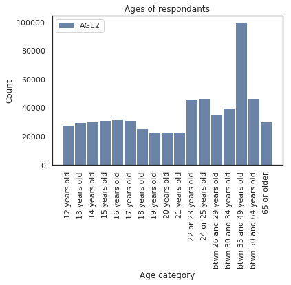

# Exploring OxyContin Use in the United States 
The primary focus of this investigation was to investigate and interpret information in the NSDUH data set on OxyContin use.

## The Data Set

For this exploration, I chose to look at data from the National Survey on Drug Use and Health from 2007 to 2017.

According to the [Substance Abuse and Mental Health Data Archive's page on the NSDUH data set](https://www.datafiles.samhsa.gov/study-series/national-survey-drug-use-and-health-nsduh-nid13517),

> "The National Survey on Drug Use and Health (NSDUH) series, formerly titled National Household Survey on Drug Abuse, is a major source of statistical information on the use of illicit drugs, alcohol, and tobacco and on mental health issues among U.S. civilians who are non-institutional population aged 12 or older. The survey tracks trends in specific substance use and mental illness measures and assesses the consequences of these conditions by examining mental and/or substance use disorders and treatment for these disorders."

This data set can be used to identify the risk of populations abusing drugs and to find links between mental health and drug use.

The terms of use for using this data can be found on the [SAMDHA terms of use page](https://www.datafiles.samhsa.gov/info/terms-use-nid3422). One of the primary terms of use is that this data cannot be used to identify individuals who participated in the survey.

### Opioid Use.
#### Questions
I chose to look at patterns in prescription opioid use. The NSDUH series provides several questions about OxyContin use under the painkillers category relating to OxyContin use. OxyContin is one of the most commonly used prescription opioids [according to the CDC](https://www.cdc.gov/drugoverdose/opioids/prescribed.html). The questions related to OxyContin use in the 2007 - 2014 surveys differ from the questions in the 2015 - 2017 surveys. For the earlier surveys, I decided to use the following questions:

1. OXYCAGE: How old were you the first time you used OxyContin that was not prescribed for you or that you took only for the experience or feeling it caused?
2. OXYCREC: How long has it been since you last used OxyContin that was not prescribed for you or that you took only for the experience or feeling it caused?
3. OXYYRTOT: Total number of days used OxyContin in the past 12 months.
4. OXDAYPYR: On how may days in the past 12 months did you use OxyContin that was not prescribed for you or that you took only for the experience or feeling it caused?

For the later surveys, I decided to look at the following question:

1. OXCNNMAGE: How old were you when you first used OxyContin in a way a doctor did not direct you to use it?

Although the wording of the question changed, I chose to treat the answers to OXYCAGE and OXCNNMAGE as answers to the same question.

#### Preparing the Data for Analysis
To create a more manageable amount of data for analysis, I created a DataFrame that just contained the columns I wanted to analyze (the questions listed in the previous section), the sample weights ('ANALWT\_C'), the age group of the respondent ('AGE2'), and the year of the survey, which I added as a column to the data.

To clean the data, I replaced several categorical codes to answers with NaNs, or with 0s, depending on the question's application. Below is a list of the variables, the codes that were replaced by another value, and the values that were substituted. These codes come from the codebooks for each survey year.:
- OXCNNMAGE:
    - 981: NEVER USED PAIN RLVRS Logically assigned -> NaN
    - 985: BAD DATA Logically assigned -> NaN
    - 991: NEVER USED/MISUSED PAIN RELIEVERS -> NaN
    - 993: DID NOT USE IN THE PAST 12 MONTHS -> NaN
    - 994: DON'T KNOW -> NaN
    - 997: REFUSED -> NaN
    - 998: BLANK (NO ANSWER) -> NaN
- OXYCAGE:
    - 981: NEVER USED OXYCONTIN Logically assigned -> NaN
    - 985: BAD DATA Logically assigned -> NaN
    - 991: NEVER USED OXYCONTIN -> NaN
    - 994: DON'T KNOW -> NaN
    - 997: REFUSED -> NaN
    - 998: BLANK (NO ANSWER) -> NaN
- OXYCREC:
    - 85: BAD DATA Logically assigned -> NaN
    - 97: REFUSED -> NaN
    - 98: BLANK (NO ANSWER) -> NaN
- OXYYRTOT:
    - 981: NEVER USED OXYCONTIN Logically assigned -> 0
    - 985: BAD DATA Logically assigned -> NaN
    - 991: NEVER USED OXYCONTIN -> 0
    - 993: DID NOT USE OXYCONTIN IN THE PAST 12 MOS -> 0
    - 994: DON'T KNOW -> NaN
    - 997: REFUSED -> NaN
    - 998: BLANK (NO ANSWER) -> NaN
- OXDAYPYR:
    - 981: NEVER USED OXYCONTIN Logically assigned -> 0
    - 985: BAD DATA Logically assigned -> NaN
    - 989: LEGITIMATE SKIP Logically assigned -> NaN
    - 991: NEVER USED OXYCONTIN -> 0
    - 993: DID NOT USE OXYCONTIN IN THE PAST 12 MOS -> 0
    - 997: REFUSED -> NaN
    - 998: BLANK (NO ANSWER) -> NaN
    - 999: LEGITIMATE SKIP -> NaN

Due to time constraints, I chose not to resample the data, however, I provided a column of weights in order to resample the data in future analysis.

After the data was cleaned, I saved the new data frame to `oxy.hdf5` under the key `OxyContin` in order to more quickly load the relevant data in the future.

## Analysis of the Data

### Age of First Use
The age at which people first try a drug can say a lot about which demographics are at a high risk of choosing to use the drug. I decided to look at the distribution of the age of the respondents, the distribution of ages that respondents first tried OxyContin non-medically, and the breakdown of that distribution by age group.

#### Distribution of Age of Respondents
To get an idea of the distribution of the ages of respondents, I made a histogram of the age groups, which can be seen below.

The 35-49 year old age group has almost twice more respondents than any other category. I was intrigued by this, which is why I chose to break down the age of first trying OxyContin non-medically by age. The rest of the distribution looks fairly flat. I am surprised by the number of young respondents in the survey.

#### Distribution of Age of First Trying OxyContin Non-medically
I first decided to look at the distribution of responses for the OXYCAGE and OXCNNMAGE variables separately because the questions were worded slightly differently. The distributions of the answers to these questions can be seen below.

For both questions, it appears that people were much more likely to try OxyContin for the first time non-medically in their late 40s and early 50s than at any other time in their lives. I found it intriguing that there is a much smaller cluster of respondents that tried OxyContin when they were less than 20 years old, but there aren't any data points for people trying it in their 20s and 30s. This makes me wary of the data. Nothing in the codebook points to the responses to the question being coded in a special way, but this clustering is very fishy. In the responses to OXCNNMAGE, there are only a handful of reported ages, which I am also surprised by.

I then combined the responses to OXYCAGE and OXCNNMAGE together into the column `agefirst`. The distributions of the combined responses are shown below.

As expected, the combined distributions look very similar to the distribution for responses to OXYCAGE alone. I chose to use this combined distribution for analyzing the answers grouped by respondent age. The median age is 50 and the IQR is 2 years, which is an extremely tight window for most people to have tried the drug for the first time.

#### Distribution of Age of First Try By Grouped by Age of Respondent
In order to get a better idea of the trend in ages that people try OxyContin non-medically for the first time, I created histograms for age groupings. These are shown below.

For the most part, I chose to use the age groupings that the survey put respondents into initially. However, for the younger ages, I decided to further group them together. The groupings I chose to look at were:
* Ages 12 - 19
* Ages 20 - 25
* Ages 26 - 29
* Ages 30 - 34
* Ages 35 - 49
* Ages 50 - 64
* Ages 65 and over

I was very puzzled by the fact that in all age groups, the majority of the respondents reported trying OxyContin for the first time non-medically in their 40s and 50s, which doesn't make sense because this is older than the age of the respondents reporting it. I can't find anything in the codebook to indicate why this would be the case, but it may be related to the observation I made that none of the respondents reported first trying OxyContin in their 20s and 30s. I'm hesitant to draw any conclusions from this analysis because the data doesn't seem to make sense. However, one interesting thing to note is that for younger respondents, there are more people who reported trying OxyContin between the ages of 8 and 25. I wonder if there is some trend in that data that is being obscured by the strange cluster around 50 years.

### Frequency of Using OxyContin Non-medically
I chose to also explore the frequency that people used OxyContin in addition to the age at which they first tried it non-medically. This is important to understand because it points to the severity of the problem. If someone tried OxyContin once non-medically and never tried it again, I would not be concerned for that person, but if they are a frequent or regular user, that is a much stronger indicator of there being a problem. The questions I analyzed in this section all came from the 2007 - 2014 surveys because the more recent surveys do not include similar questions or information.

#### Last Time Using OxyContin Non-medically
I first wanted to look at the last time people who took OxyContin non-medically used it. The histogram of some of the responses to OXYCREC is shown below.

This is only representative of the people who used OxyContin non-medically at all. In the data I cleaned, there appear to be no responses coded for people who never used OxyContin non-medically or ever, which is inconsistent with what is reported in the codebooks. However, I couldn't find the reason for the missing data. It appears that most people who had ever taken OxyContin non-medically took it within 12 months of the survey, which could make sense given that opioids are highly addictive, and if someone were to use them non-medically, they would be likely to use them frequently. The large majority reported using OxyContin at least a month prior to the survey.

#### Total Days Using OxyContin in the Last Year
I next wanted to look at the total number of days that people used OxyContin in the last year to get a better indicator of the frequency of use. The PMF and CDF of the responses to OXDAYPYR are shown below

The first thing I noticed is that very few people reported 0 days of use in the past year, which is highly improbable considering that so many of the people surveyed were children, and even among adults, I wouldn't expect to see close to everyone having taken OxyContin in the last year at some point. This is, however, probably indicative of the fact that there seem to be missing respondents in the data who have never taken OxyContin, as discussed in the previous section. The likelihood of a respondent having taken OxyContin at least 30 days in the last year is close to 50%. Another indicator that this data is not correct is that no respondents took OxyContin for more than 50 days in the year prior to the survey. This is confusing because I would expect at least a handful of respondent to have reported using OxyContin nearly every day in the year. Given these observations about the data, I cannot confidently draw any hypotheses or conclusions from these distributions.

## Conclusion
I ended up not coming to a great number of conclusions based on this data. Although I could not pinpoint a specific reason, the responses to the questions I was looking at did not make sense or were missing large pieces of information. Some trends I observed that could merit future analysis were that young people were more likely to try OxyContin non-medically earlier than the age of 20, and that most people who used OxyContin non-medically at some point in their lives had also used it non-medically in the year prior to the survey they participated in.

## Future Work
Although this analysis yielded very little useful information, I still believe that there is a lot to be learned from the NSDUH data set with some more understanding of how responses to questions were recorded and coded. In addition to making sure data was interpreted and collected correctly, I would be interested in the future to dive deeper into the relationship between the age of respondents and the age at which they first tried OxyContin.

Finally, I think that it is important in future work to look at the relationship between OxyContin use and other opioid use. I do not think that OxyContin alone is representative of opioid use in the United States, and I would be especially interested to see how prescription and non prescriptions opioids like heroine are related.
