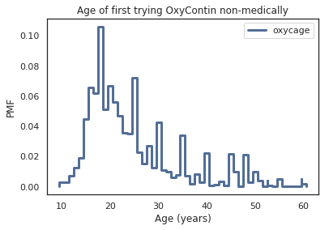
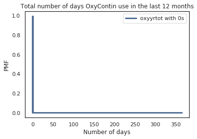
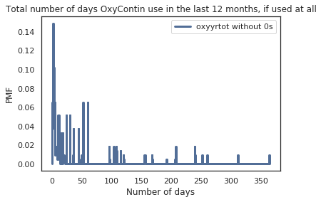
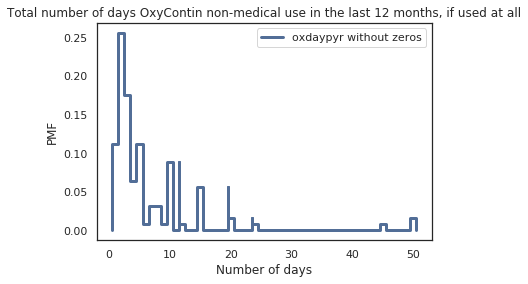
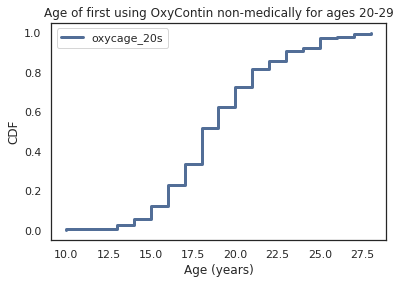
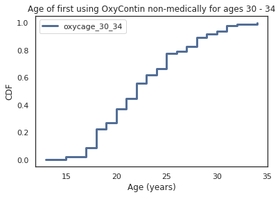
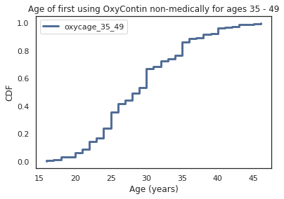
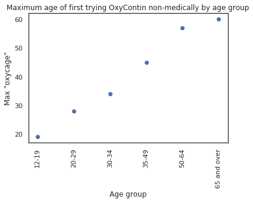

### Exploring OxyContin Use in the United States 

#### Introduction
The primary focus of this investigation was to investigate and interpret information in the NSDUH data set on medical and non-medical OxyContin use.  [According to the CDC](https://www.cdc.gov/drugoverdose/opioids/prescribed.html), OxyContin is among the most common prescription opioids involved in overdose death. OxyContin was approved for use by the FDA in 1995. The FDA at the time believed that because the drug was formulated to be slowly released in the body it would be less easy to abuse. However, since its approval OxyContin became the center of the opioid problem ([source](https://www.fda.gov/downloads/Drugs/DrugSafety/InformationbyDrugClass/UCM566985.pdf)).

#### The Data Set

For this exploration, I chose to look at data from the 2014 National Survey on Drug Use and Health (NSDUH). This survey includes a number of questions asking participants about their history of OxyContin use, among other painkillers. NSDUH surveys after this year scaled back their specific OxyContin-related questions, so I chose to use the most recent survey in this study that provided a fair amount of information.

According to the [Substance Abuse and Mental Health Data Archive's page on the NSDUH data set](https://www.datafiles.samhsa.gov/study-series/national-survey-drug-use-and-health-nsduh-nid13517),

> "The National Survey on Drug Use and Health (NSDUH) series, formerly titled National Household Survey on Drug Abuse, is a major source of statistical information on the use of illicit drugs, alcohol, and tobacco and on mental health issues among U.S. civilians who are non-institutional population aged 12 or older. The survey tracks trends in specific substance use and mental illness measures and assesses the consequences of these conditions by examining mental and/or substance use disorders and treatment for these disorders."

This data set can be used to identify demographics of people at risk for abusing drugs and to find links between mental health and drug use.

The terms of use for using this data can be found on the [SAMDHA terms of use page](https://www.datafiles.samhsa.gov/info/terms-use-nid3422). One of the primary terms of use is that this data cannot be used to identify individuals who participated in the survey. I have not provided any identifying information about participants in this study.

##### Study Details
The codebook for the 2014 NSDUH study can be found [here](http://samhda.s3-us-gov-west-1.amazonaws.com/s3fs-public/field-uploads-protected/studies/NSDUH-2014/NSDUH-2014-datasets/NSDUH-2014-DS0001/NSDUH-2014-DS0001-info/NSDUH-2014-DS0001-info-codebook.pdf).

The target demographic of the survey is the civilian, non-institutionalized population of the United States who were 12 years of age or older at the time of the survey. The sample population includes the household population of all 50 states and the District of Columbia. Along with households, residents of non-institutional group quarters, such as dormitories, and people with no permanent residence. States with larger populations had larger sample sizes than smaller states and the District of Columbia. The sample allocations for the age groups surveyed are as follows: 25% for 12-17 year olds, 25% for 18-25 year olds, 15% for 26-34 year olds, 20% for 35-49 year olds, and 15% for adults over 50 years old.

The study was conducted using computer-assisted-interviewing (CAI) methods. This includes both computer-assisted personal interviews, and computer-assisted self interviews. The core of the study includes questions on the use of tobacco, alcohol, marijuana, cocaine, crack cocaine, heroine, hallucinogens, inhalants, pain relievers, tranquilizers, stimulants, and sedatives. There are also supplemental questions on demographics and mental health.

There are limitations of the 2014 survey listed in the codebook for this survey, which are important to note:
1. The data in the survey is self-reported, which means that it relies on the memory and truthfulness of the respondents' answers.
2. The survey is cross-sectional. Participants were interviewed once and not followed for additional interviews in the future, so the survey does not provide information on how an individual's drug use changes over time.
3. The survey targets the civilian population of the United States, so active-duty military and individuals in institutional group quarters such as prisons and nursing homes are excluded. The codebook estimates that about 3% of the US population is excluded for this year.

##### Survey Variables Used in Study
The 2014 NSDUH survey includes several variables pertaining to OxyContin use. I decided to use the following questions:

1. OXYCAGE: AGE WHEN FIRST USED OXYCONTIN NONMEDICALLY
    -How old were you the first time you used OxyContin that was not prescribed for you or that you took only for the experience or feeling it caused?
2. OXYCREC: TIME SINCE LAST USED OXYCONTIN NONMEDICALLY
    -How long has it been since you last used OxyContin that was not prescribed for you or that you took only for the experience or feeling it caused?
3. OXYYRTOT: TOTAL # DAYS USED OXYCONTIN PAST 12 MONTHS
    -Total number of days used OxyContin in the past 12 months.
4. OXDAYPYR: # DAYS USED OXYCONTIN "NM" PAST 12 MONTHS
    -On how may days in the past 12 months did you use OxyContin that was not prescribed for you or that you took only for the experience or feeling it caused?

It is important here to define the term *non-medically* as "use of the substance that was not prescribed for the respondent, or that the respondent took only for the experience or feeling it caused. I will be using this term frequently throughout this report.

All of these questions came from the pain reliever section of the self-administered substance use questions of the data set. Some logical editing was performed on these questions. The full procedure can be found in the codebook under the Logical Editing section, but in summary, variables were reassigned for consistency across respondent answers. An example is if the respondent answered that they have never used a particular drug, but later listed a version of that drug as something they had used, their answer to the first question was logically assigned to be that they had used it at some point.

Along with the OxyContin-specific questions, I also looked at a variable relating to the age of the participants.
1. AGE2: RECODE - FINAL EDITED AGE

This variable was determined using the respondents' answers reported age, birthday, and the time the study was conducted. It groups respondents into 17 age groups, with the range of ages in each group varying.

Finally, I also used the final person-level weights calculated for each participant for resampling ('ANALWT_C'). This variable indicates the number of people one respondent represents in the study.

###### Preparing the Data for Analysis
To create a more manageable amount of data for analysis, I created a DataFrame that only contained the columns of the 2014 NSDUH survey that I wanted to analyze (the questions listed in the previous section), the sample weights ('ANALWT\_C'), the age group of the respondent ('AGE2'), and the year of the survey, which I added as a column to the data. Because the data was given categorically, I converted it to numeric values as well.

To clean the data, I replaced several categorical codes to answers with NaNs, or with 0s, depending on the question's application. Below is a list of the variables, the codes that were replaced by another value, and the values that were substituted. These codes come from the codebooks for each survey year.:
- OXCNNMAGE:
    - 981: NEVER USED PAIN RLVRS Logically assigned -> NaN
    - 985: BAD DATA Logically assigned -> NaN
    - 991: NEVER USED/MISUSED PAIN RELIEVERS -> NaN
    - 993: DID NOT USE IN THE PAST 12 MONTHS -> NaN
    - 994: DON'T KNOW -> NaN
    - 997: REFUSED -> NaN
    - 998: BLANK (NO ANSWER) -> NaN
- OXYCAGE:
    - 981: NEVER USED OXYCONTIN Logically assigned -> NaN
    - 985: BAD DATA Logically assigned -> NaN
    - 991: NEVER USED OXYCONTIN -> NaN
    - 994: DON'T KNOW -> NaN
    - 997: REFUSED -> NaN
    - 998: BLANK (NO ANSWER) -> NaN
- OXYCREC:
    - 85: BAD DATA Logically assigned -> NaN
    - 97: REFUSED -> NaN
    - 98: BLANK (NO ANSWER) -> NaN
- OXYYRTOT:
    - 981: NEVER USED OXYCONTIN Logically assigned -> 0
    - 985: BAD DATA Logically assigned -> NaN
    - 991: NEVER USED OXYCONTIN -> 0
    - 993: DID NOT USE OXYCONTIN IN THE PAST 12 MOS -> 0
    - 994: DON'T KNOW -> NaN
    - 997: REFUSED -> NaN
    - 998: BLANK (NO ANSWER) -> NaN
- OXDAYPYR:
    - 981: NEVER USED OXYCONTIN Logically assigned -> 0
    - 985: BAD DATA Logically assigned -> NaN
    - 989: LEGITIMATE SKIP Logically assigned -> NaN
    - 991: NEVER USED OXYCONTIN -> 0
    - 993: DID NOT USE OXYCONTIN IN THE PAST 12 MOS -> 0
    - 997: REFUSED -> NaN
    - 998: BLANK (NO ANSWER) -> NaN
    - 999: LEGITIMATE SKIP -> NaN
    
I chose to replace some codes in the last two variables with 0s because respondents could either give a number of days or answer that they never used OxyContin in the last 12 months or ever. I wanted to make it easier to visualize these answers along with the responses from people who had used OxyContin in the past year, so I converted them to a usable numeric value. This has the added benefit of being very easy to filter out when looking at only the people who used OxyContin in the 12 months prior to the survey.

Finally, I resampled the cleaned data using the person-level sample weights.

#### Analysis of the Data

##### Individual Variables
I started my analysis by looking at the individual variables to get an idea of the responses to the survey and to pull out any information that may generate more analysis questions.

###### Age of Respondents.

The 'AGE2' variable groups respondents into 17 categories:
1. Respondent is 12 years old
2. Respondent is 13 years old
3. Respondent is 14 years old
4. Respondent is 15 years old
5. Respondent is 16 years old
6. Respondent is 17 years old
7. Respondent is 18 years old
8. Respondent is 19 years old
9. Respondent is 20 years old
10. Respondent is 21 years old
11. Respondent is 22 or 23 years old
12. Respondent is 24 or 25 years old
13. Respondent is between 26 and 29 years old
14. Respondent is between 30 and 34 years old
15. Respondent is between 35 and 49 years old
16. Respondent is between 50 and 64 years old
17. Respondent is 65 years old or older

The PMF and CDF of the ages are shown below.

Respondents are more likely to be from the three oldest age groups, but the younger age groups are also smaller in range, so this makes sense. To get a better idea of the age distribution, I compressed the younger age groups into larger groups. The new age groups I made are:
1. Respondent is between 12 and 19 years old
2. Respondent is between 20 and 29 years old
3. Respondent is between 30 and 34 years old
4. Respondent is between 35 and 49 years old
5. Respondent is between 50 and 64 years old
6. Respondent is 65 years old or older

The PMF and CDF of the new groupings are shown below.

The three oldest age groups are still the most represented, but this still makes sense because the younger groups still have smaller age ranges.

###### Age of First Trying OxyContin Non-medically
The 'OXYCAGE' variable represents the age at which people first used OxyContin non-medically. Because of the way the question was asked and the way I cleaned the data, this variable only represents the respondents who have ever used OxyContin non-medically in their lives. The PMF and CDF of 'OXYCAGE' are shown below.

The median age is 22, the mean age is 24.55, and the interquartile range is 10 years. So, respondents who have ever used OxyContin non-medically are much more likely to try it in their 20s for the first time than at older ages. This is consistent with what I expected to see. I expect that young people are more likely to use medication in a way that was not directed by a doctor. I would also expect young people to experiment with more drugs based on anecdotal evidence.

The distribution is skewed right, since the median is less than the mean. This is also consistent with what I expected of this data. Very young people are probably not going to have the freedom or wish to take drugs in a way not directed by their doctor, but people in their 30s upwards are probably more likely to be prescribed or have access to OxyContin, and they may choose to take it in a way other than prescribed. 

###### Time Since Last Trying OxyContin Non-medically
The 'OXYCREC' variable represents the time since respondents reported last using OxyContin non-medically. This variable includes both people who have used OxyContin non-medically ever in their lives as well as people who have never used it. The PMF of this variable is shown below.

An overwhelming majority of respondents reported never using OxyContin in their lives, so it is hard to get a clear idea of what the distribution of the respondent who have ever used OxyContin non-medically looks like. I removed the respondents who mapped to having never used OxyContin to better visualize this group. The PMF of the result is shown below.

Out of the people who reported ever using OxyContin, an overwhelming majority (82%) used it over 12 months ago. This is consistent with the finding that respondents were much more likely to use OxyContin non-medically for the first time in their 20s coupled with the finding that a majority of the respondents were over 30 at the time of taking the survey.

###### Total Number of Days Using OxyContin in 12 Months Prior to Survey

The 'OXYYRTOT' variable represents the total number of days respondents reported having used OxyContin at all (medically or non-medically) in the 12 months prior to the survey. Recall that answers to this question that were coded as some form of "never used OxyContin" or "haven't used OxyContin in the last 12 months" were mapped to 0s for analysis.  This distribution is representative of both respondents who have ever used OxyContin and who have never used OxyContin. The PMF of the responses to this question are shown below.

As expected based on the previous variable, almost all respondents (99.6%) have a 0 for this variable. I then looked at just the respondents who had ever used OxyContin in order to get a better idea of the distribution. The PMF and CDF of the non-0 responses are shown below.

For the non-0 responses, the median number of days is 10, the mean is 40.3 days, and the maximum is 364 days. The IQR is 33 days. These plots are consistent with what I would expect. The majority of the respondents who have ever used OxyContin used it less than two weeks out of the year. The data is skewed right with a very long tail, which makes sense because I would expect to see a small number of heavier users (these people may be prescribed the drug for severe chronic pain and use it as directed, or have an addiction to the drug to name a couple of scenarios for heavier use).

###### Number of Days Using OxyContin Non-Medically in 12 Months Prior to Survey

The variable 'OXDAYPYR' differs from 'OXYYRTOT' in that it only represents the number of days that the respondents reported having used OxyContin non-medically, as opposed to any use of the drug. I expected to see a similarly shaped distribution to 'OXYYRTOT' with most respondents never having used the drug and most who had having used it for a small number of days. Recall that I assigned 0s to respondents who reported never having used the drug or not having used it in the last 12 months.

99.8% of respondents had 0 days, so I again decided to look at just the respondents who had 1 or more days. The PMF and CDF of the distribution of these respondents are shown below.

The mean number of days is 6, the maximum number of days is 50, the median number of days is 3, and the IQR is 5. Like the distribution for 'OXYYRTOT', this distribution is also skewed right. The majority of people who took OxyContin non-medically in the past 12 months took it for less than a week total. It is interesting to note that almost all respondents took it non-medically for no more than 50 days, as opposed to in the previous section where there were a significant number of people who reported in the hundreds of days. I can imagine a couple of reasons why. One is that people who used OxyContin non-medically had a prescription, or knew someone with a prescription, and they may have used it non-medically for a temporary severe pain they were experiencing instead of going to the doctor. I have anecdotal evidence from several acquaintances that is consistent with this guess. Another reason may be that it is more difficult to obtain OxyContin so regularly without a prescription, so people are much less likely to use the drug frequently unless they have a medical reason to use it. A final reason may be that OxyContin is very strong, and people with opioid dependencies may be more likely to use a less strong drug more frequently. This would require more data on other types of opioids to test.

##### Relationships by Age

I next set out to see if there was a relationship between the age of respondents and the age that the respondents reported first trying OxyContin non medically for the first time, in order to see if there is an increasing problem with non-medical OxyContin use, and if so, which age groups are most at risk.

The CDFs of 'OXYCAGE' (The age respondents reported first using OxyContin non-medically for the first time) are shown below.

There are some aspects of these CDFs that are expected. The first is that the maximum age increases with the ages represented. This makes sense because of the upper bounds of the age range. People cannot report having tried OxyContin non-medically for the first time at an age greater than the age they were when they took the survey. It might be worth noting that the three youngest age groups have a maximum that is within 1 year of the oldest respondents in the group, and the three older age groups have a larger gap between the maximum value and the oldest age represented by the group. This is consistent with the fact that people are more likely to try OxyContin non-medically for the first time in their 20s.

The plots below show the maximum, minimum, and median ages that people reported for this question by age group.

Interestingly, all age groups have a minimum between 10 and 13, except for the oldest group. So, that indicates that some participants reported trying the drug before it was available. The wording of the question, according to the codebook, is "How old were you the first time you used OxyContin that was not prescribed for you or that you took only for the experience or feeling it caused?"

Another interesting point about the minimums of these age groups is that the youngest age group also has the smallest minimum, at 10. I think if I were to look at multiple years of the NSDUH survey, I would investigate if this minimum is consistently smaller than the minimums of the other age groups. If it is, and this is a statistically significant result, that might indicate that people are trying OxyContin at increasingly younger ages.

Finally, the median age decreases with age. To a certain extent, this is expected because older age groups would not have had access to the drug until they were older because it wasn't available yet. However, this trend is concerning for the 3 youngest age groups who did have access to the drug at a very young age. The decrease in the median age for younger age groups could indicate that younger people are more likely to try OxyContin at a younger age, which could mean that they are more at risk of becoming addicted to the drug over the course of their lives. Of course, there are limitations to this conclusion, due to the fact that the data was self reported and is only for one year of survey data. I would hesitate to draw strong conclusions, but I think it is worth considering looking into this trend more for future analysis.

#### Future Work
This exploration of the 2014 NSDUH on OxyContin use was great for recognizing trends for one year of responses, but I would want to explore more years of the survey to draw stronger conclusions. Unfortunately, the surveys after 2014 only include OxyContin-specific questions about the year respondents first tried OxyContin for the first time. This is useful for continuing to examine the relationship between age and OxyContin use, but any information about the frequency of use is lost.
