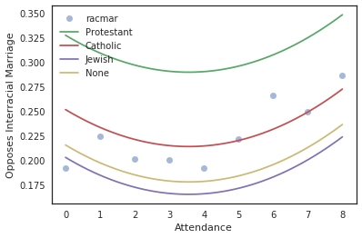
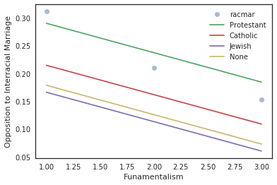
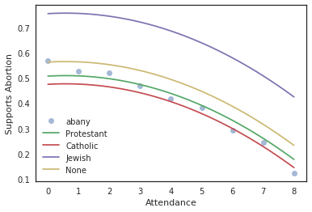
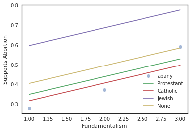
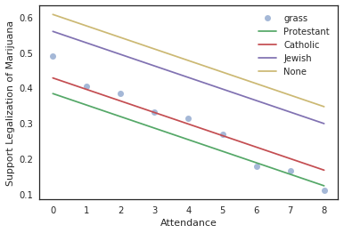
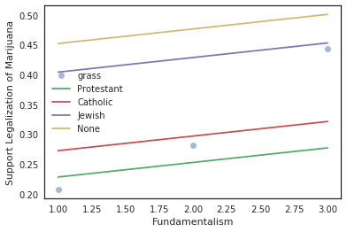

# The Virtue of the God-fearing Man
###### By: Jordan Crawford-O'Banner

Religion is tied deeply into the foundations of human society. From it, we have derived morals, ideologies and entire schools of thought. More often than not, religion is tied to the idea of being a good or moral person. The belief is that if you are a God-fearing person and you follow all of the guidelines set out by your belief system you will be rewarded because you have been a good person. Considering the wide number of religions and ideologies in the world, there is a question of whether or not being a more religious person actually makes you a more moral person. However, it would be irresponsible to presume that I can define whether or not a person's belief or actions make them more moral than another. I will therefore be using moral foundation theory to define what a religious person values most and see how a person who is less religious aligns with those vales To see the code, please go [here](https://github.com/jcrawfordobanner/ThinkStats2/blob/master/project2/project2.ipynb).

We will try to predict the moral values of a religious person by using data from the General Social Survey to correlate a persons views on various issues with how religious they are. We will estimate how religious a person is by how often they attend religious meetings and how fundamentalist they consider their religion. Attendance has responses numbered from 0 to 8, with 0 representing never having attended a service and 8 representing going to a service everyday. Fundamentalism is represented by a response from 1 to 3 with 1 representing people identifying their religion as being fundamentalist and 3 representing people identify their religion being liberal. Each of the issues will be categorized according to which of the values within moral foundation theory they appeal to. Moral foundation theory states that all of human moral reasoning stems from six innate, modular foundations.

- Liberty: the power or scope to act as one pleases; opposite of oppression
- Purity: abhorrence for disgusting things, foods, actions; opposite of degradation
- Fairness: rendering justice according to shared rules; opposite of cheating
- Care: cherishing and protecting others; opposite of harm
- Loyalty: standing with your group, family, nation; opposite of betrayal
- Authority: submitting to tradition and legitimate authority; opposite of subversion

Everyone cares about all of these values, but different groups and individuals may value certain foundations more than others. We would assume that people who are more religious would value purity, loyalty and authority than people who do not have a religion or do not participate in religious activities very often. People who are less religious would therefore value liberty, fairness and care more.

Above there is a histogram of the number of respondents within different religions. The data is gathered from the gss question which asks, "What is your religious preference? Is it Protestant, Catholic, Jewish, some other religion, or no religion?"  Of the possible answers to the survey: 1 is Protestant, 2 is Catholic, 3 is Jewish, 4 is None, 5 is Other, 6 is Buddhist, 7 is Hindu, 8 is Other eastern religion, 9 is Muslim, 10 is Orthodox Christian, 11 is Christian, 12 is Native American and 13 is Interdenominational. It is clear that Protestants make up the large majority of the respondents to the survey, which means that the data may be skewed in towards the specific beliefs of Protestants or the other Christian denominations that make up a majority of the respondents to the survey.

## Interracial Marriage
The first issue that we will look at is interracial marriage. The gss poses respondents the question, "Do you think there should be laws against marriages between (Negroes/Blacks/African-Americans) and whites?" Respondents answered with 1 if they agreed and 0 if they disagreed. The issue of interracial marriage covers many moral foundations including: loyalty, liberty,fairness and sanctity. If a respondent favored having a law against interracial marriage then they would value loyalty and sanctity more than liberty and fairness in this situation. They would prefer to uphold the purity of marriage as a traditional practice by only marrying people within their identified group.

Using the data from the gss survey we can create a linear regression model relating attendance and fundamentalism to opinions on interracial marriage. A nonlinear term is included for attendance because the relationship between attendance and interracial marriage does not seem to be directly linear. We can then make predicted curves based on the model for different religions. We will only plot lines for Protestantism, Catholicism, Judaism, and people who identified as not having a religion.

The first plot shows the predicted curves for each religion plotted against the mean of the data grouped by attendance to church and the second graph shows the same curves plotted against the mean of the data grouped by fundamentalism. The attendance graph shows that people who attend religious meetings a moderate amount are most likely to oppose a law against interracial marriage as they are 2.5% less likely than people who never attend a religious meeting. People who have never attended a church service are more likely to support the law than people who attend church a moderate amount, but they are 2.5% less likely to support the law than people who attend church meetings frequently. The fundamentalism graph shows that the most fundamentalist were about 7.5% more likely to support the ban than the liberal respondents. This shows that the people who are more religious tend to support the law rather than people who are not religious. This confirms that religious people are more likely to value loyalty and sanctity.

If we look at the different religions on the graphs, we can see that Protestants are the most likely to support the ban on interracial marriage, while Jewish people are most likely to oppose the ban. The Protestants are about 12.5% more likely to support the ban against interracial marriage. Jewish people are also 2.5% more likely to oppose the ban than people who identify as not having a religion. It appears that Protestants by far value loyalty and sanctity more than the other religions we have plotted, while Jewish people value liberty and fairness the most.

## Abortion

The next issue we will look at is abortion. The General Social Survey poses the question, "Please tell me whether or not you think it should be possible for a pregnant woman to obtain a legal abortion if the woman wants it for any reason?" The issue of abortion always involves sanctity, as it involves the belief that someone may or may not be killing a living thing. As the question is posed, there is also the involvement of liberty, because the woman would be able to have an abortion for whatever reason they wanted. The question of whether abortion should be legal or not has been linked to religious belief many times in the past, which may mean there will be a higher correlation between the data and the explanatory variable we have been using. Based upon the previous issue of interracial marriage, we would expect that a more religious respondent would be more likely to oppose abortion because they value purity more than liberty, while less religious respondents are in favor of abortion because they value liberty more than sanctity.

We once again use linear regression to model the data. The relationship between attendance and abortion is nonlinear just like with interracial marriage, however it is far closer to being linear than the previous issue.

The attendance graph shows that people who do not attend religious services are far more likely to support abortion than people who attend them very frequently. The more often a person attends religious meetings the more likely they are to not support a women having an abortion for any reason she wishes. People who never attend religious meetings are 45% more likely to support abortion than people who attend religious meetings daily. The fundamentalism graph shows that people who consider their religion fundamentalist are far more likely to be against abortion for any reason when compared to people who consider their religion liberal. They are 30% more likely to be against it. This falls in line with out prediction once again. The people who are most religious value purity, while those who are less religious value liberty.

Once again, Jewish people are the people who are most likely to value liberty as they are most likely to support abortions for any reason. Catholics are the most against abortions and a 30% less likely to support abortion when compared to Jewish people. Jewish people are also far more likely to support abortion than people who identify as having no religion as they have a 20% higher chance of supporting it. The people who identify as having no religion are far closer in opinion to the Protestants and the Catholics this time. Although our metric for being more religious is using attendance and fundamentalism. it is interesting to see that the people who do not belong to a religious group align their ideals with people who fall under denominations of Christianity than the Jewish people.

### Marijuana Legalization'

Drug use has been considered a very important moral issue throughout the United State, especially in the modern era. The General Social Survey asked its respondents, "Do you think the use of marijuana should be made legal or not?" The respondents answered 1 if they agreed and 0 if they disagreed. The use of marijuana has been considered an immoral act until very recently and so there has been some debate over whether the drug is okay to use in any setting whether it be medical or recreational. This issue involves care and liberty. It involves care because it is a worry about the way drug use can affect the health of a person and liberty because it involves being able to do an act as long as one knows the potential dangers that can come of it.

After creating a linear regression model, we can view the predicted curves from the data. Unlike the previous issues, the predicted curves for marijuana legalization stray farther away from the mean graphs. This shows that the model may not match the data exactly. If we go by the mean graphs people who never attend religious meetings are 40% more likely to support the legalization of marijuana than people who attend religious services every day. The predicted graphs show that any particular religious group is only 20% more likely to support marijuana legalization if they never go to a religious meeting rather than going to a meeting everyday. According to the mean graph, the most fundamentalist respondents are 25% less likely to support marijuana legalization than respondents who are liberal. The predicted curves show that the most fundamentalist are only 5% less likely to support marijuana legalization when looking at any specific religious group. This once again confirms that those who are more religious are more likely to value care more than liberty.

### Conclusion
We are attempting to categorize the morals of people based upon an estimate of how religious they are. We have looked at issues of interracial marriage, abortion and marijuana legalization, which have altogether covered the categories of fairness, liberty, sanctity and care. People who are most religious have a tendency to value sanctity and care more than people who are not very religious, whereas people who are not very religious tend to value liberty and fairness more. This is not to say that these two groups do not still hold the values. It only means that in comparison to one another their priorities lie in very different places.
