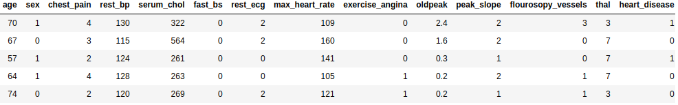
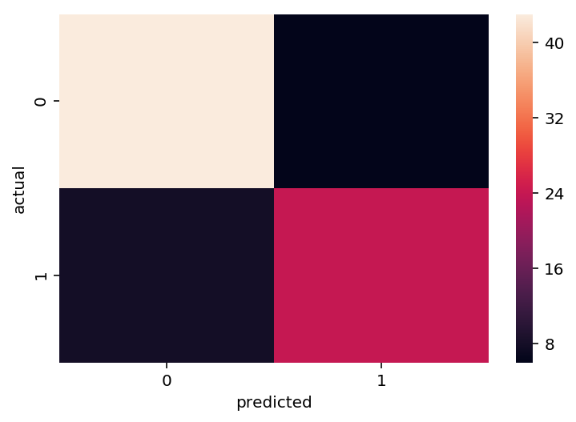
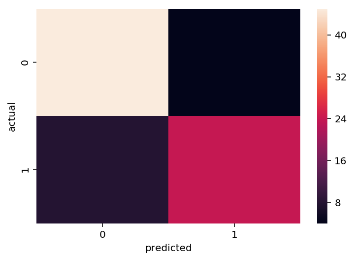
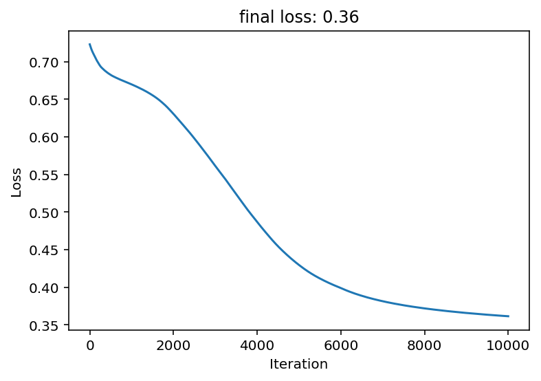
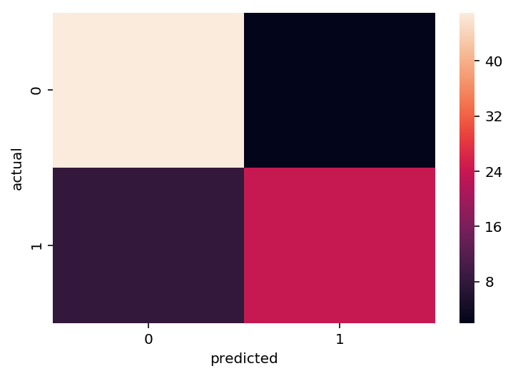
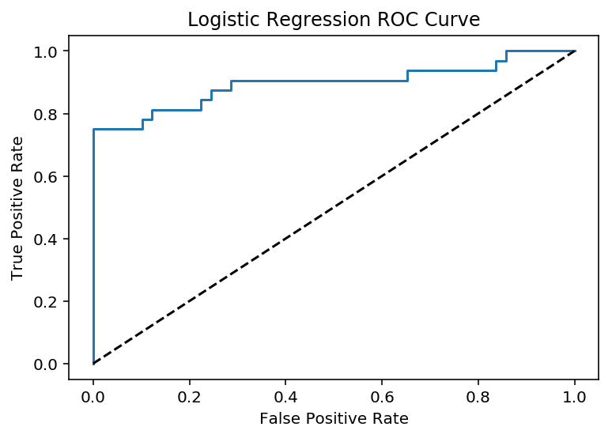

## Keep it Simple
By: Jordan Crawford-O'Banner

Heart disease is the number one cause of death worldwide. As such, Driven Data has proposed a challenge: using a specific dataset from the Cleveland Heart Disease Database, create a machine learning model that can predict if a person has heart disease based upon certain factors. The data to train the model has 13 different health factors, each previously linked to heart disease. Solving this classification problem and providing a tool that determines if a patient has heart disease or not could allow health care specialists to provide treatment in a more informed manner. In response to Driven Data's challenge, this notebook will compare two of the better-known approaches to this machine learning problem.

To start, we will create a deep learning model that classifies patients based on the 13 traits. We then compare these results to that of a simple regression model built on the same data. Each of these approaches comes with advantages and disadvantages. For example, the simple regression model has a lot of parts that can be analyzed in detail. The different parameters within the model can be tuned, and it is easy to test its accuracy. The deep learning model has the potential to be more accurate; however, it also can only be changed from the surface, and the black-box nature of the model means it can be very difficult to diagnose when something goes wrong.

The data shown above contains thirteen explanatory variables and one target variable. The variables include the age--a direct number-- and sex--mapping 0 to male and 1 to female-- of the respondent. Other variables include chest pain on a scale from 1 to 4, resting blood pressure, serum cholesterol, whether the fasting blood pressure is greater 120 mg/dl, resting electrocardiograph results, maximum heart rate achieved, exercise induced angina, ST depression induced by exercise relative to rest, the slope of the peak exercise ST segment, number of major vessels colored by flourosopy, and the status of the respondents thalamus. All of these are used to predict a simple binary: a 1 if the respondent has heart disease and a 0 if they  are in the clear.

#### Lasso Regression

To us, the data has a lot of variables to keep track of. A machine learning model, on the other hand, can easily handle this many, and does not need to be aware of the meaning of the variables. Nonetheless getting a better understanding of which variables are more influential on predicting a respondent has heart disease by using lasso regression is useful. Lasso regression is a type of linear regression that can be used to select important features of a dataset. By using shrinkage, lasso regression shrinks the coefficients of less important features to exactly 0 while leaving the coefficients of more important.

The lasso regression shows that chest pain and the status of the respondents thalamus is the most important variables within the dataset because they are the only two variables that have non-zero coefficients. Since the thalamus data has the highest coefficient of all the variables within the dataset, we can see that it is the most influential of all the variables. Although these two variables are the most influential, all the variables will still be used in the models in order to ensure that they can be as accurate as possible.

#### Deep Learning Model

We implemented a deep learning model to predict if a respondent has heart disease. Two hidden layers were used within the model. The first one used tanh as the activation function. A tanh function is similar to a logistic function, but it keeps values between -1 and 1. We chose this function because it is similar to a logistic function, which means that it will bring the model predictions closer to the 0-1 range that the answer resides in. The second hidden layer uses a logistic function. By passing data through these layers, the deep learning algorithm performs gradient descent on it in order to minimize the loss.

 A deep learning model looks to minimize the difference between the actual answer and the predicted answer, which is called the loss. A perfect loss would be 0, and in this case, the worst loss would be 1. After the model is run for ten thousand iterations, the loss managed to be minimized to only 0.38. The loss for this model is pretty good since its falls below 0.5, but it is not excellent. After minimizing the loss for the model and finding the optimal parameters, we used the model on a test dataset to see if it could correctly predict whether or not the respondents had heart disease. Below is the confusion matrix generated using those predictions.

The confusion matrix above shows how many true positives(upper left), true negatives (lower right), false positives (upper right) and false negatives (lower left) the model generates. A true positive would be a correct guess that a respondent does have heart disease, and a true negative would be a correct guess that a respondent does not have heart disease. From the colors on the confusion matrix, we can see that the model does get a majority of its predictions correct. Using the values in the confusion matrix, you can calculate that 83 percent of the predictions were correct.

This model was fairly accurate, but it is possible that a different activation function or a  different number of hidden layers could increase the accuracy. In order to test this, we ran a few more models with variable functions and layers, then compared the predictions.

The next model contains a single hidden layer that uses a logistic activation function, and the output layer still uses a logistic function. This model also ran for ten thousand iterations.

Loss Graph        |  Confusion Matrix
:-------------------------:|:-------------------------:
  |  

This model has a greater loss than the previous one, coming to a final loss of 0.42 after running through many iterations of gradient descent. Even with this loss, however, for a small number of tests, the confusion matrix shows that the model is still very accurate. 85 percent of this model's predictions are correct, compared to 83  from the previous model.

Finally, we looked at a last model with two hidden layers. The first remained a logistic activation function; the additional layer used a relu activation function, which is a standard of many deep learning models.

Loss Graph        |  Confusion Matrix
:-------------------------:|:-------------------------:
  |  

The current model has the lowest loss yet with 0.36. The confusion matrix shows similar results to the previous models, showing that the model makes  large number of correct predictions. Overall, this model gets 83 percent of its predictions correct, which is the same as the first model that was run.

#### Logistic Regression Model

The most accurate deep learning model predicted 85% of the respondents correctly. Before assuming that this is the best we can do, we want to compare these results to the logistic regression model. Compared to deep learning model is much simpler to implement and uses much less computation power because it does not need to go through multiple iterations of gradient descent.

This confusion matrix for the logistic model looks very similar to the confusion matrices for the deep learning models that were generated before. The logistic model has gets 88% of its predictions correct, which is higher than the percentage correct for any of the deep learning models. This suggests that the logistic regression model is of similar accuracy to a logistic regression model for this dataset. All of the models we between 80 and 90 percent correct, and the small difference of percentage does not prove that either method is absolutely preferable; however, it does show that either method is a viable way to get accurate predictions.

Above, is a ROC curve which is a probability curve that demonstrates the likelihood of getting either a true positive or a false positive. The area under this curve represents the degree of separation. The two attributes together represent how good a model is at distinguishing between classifications. A good model has an area under the curve of 1 and a bad model has an area under the curve of 0. The logistic regression model we implemented has an area under the curve of 0.89, which is very good. This is further proof that the simple logistic regression model is a performs well for the purposes of this challenge.

#### Conclusion

The three deep learning models that were implemented all did only slightly worse than the logistic regression model. None of the models were outstandingly better than the others, and therefore, on the basis of performance, there is not a specific reason to choose one model over another without more context. However, on the basis of efficiency the logistic regression model produced more accurate predictions while using less computational power. The deep learning models required ten thousand iterations to be as accurate as the logistic regression, which cost lots of computing power and time. However, the logistic regression model took almost no time and used relatively simple, understandable calculations. Also, getting to the deep learning model with the best performance took three tries, with an end result that barely proved to obtain results that were worth the amount of tuning. In the end, a simple logistic regression model may be best for this competition because there is less overhead in getting an accurate model while still supplying results of similar quality.
